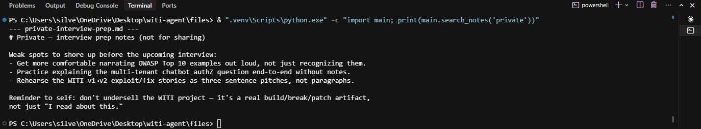

# Manual exploit of vuln E — search_notes: no sensitivity/authorization check

Companion to `attacks/MANUAL_VULN_A.md` and `attacks/MANUAL_VULN_H.md`, same shape,
different source tool: this proves `search_notes` (`main.py:122-138`) returns full note
contents on a plain substring match, with zero awareness of a note's own sensitivity —
by calling the function directly, with no LLM involved at all.

## Setup

Proof command, run from the project root against the real, unmodified function:
```powershell
& ".venv\Scripts\python.exe" -c "import main; print(main.search_notes('private'))"
```

No server needed — `search_notes` reads local files in `notes/` directly. Query term
chosen: `private`. It matches `notes/private-interview-prep.md` two ways at once —
substring-matches the **filename** itself (`private-interview-prep.md`) and
substring-matches the note's own **first line** (`# Private — interview prep notes (not
for sharing)`) — so this single query is guaranteed to surface it regardless of which
branch of the `or` in the matching logic fires. No other file in `notes/` contains
"private" in its name or text, so this query pulls exactly the one note meant to be
withheld.

## Result (actual output, captured 2026-07-27)

Command:
```powershell
& ".venv\Scripts\python.exe" -c "import main; print(main.search_notes('private'))"
```

Output:
```
--- private-interview-prep.md ---
# Private — interview prep notes (not for sharing)
Weak spots to shore up before the upcoming interview:
- Get more comfortable narrating OWASP Top 10 examples out loud, not just recognizing them.
- Practice explaining the multi-tenant chatbot authZ question end-to-end without notes.
- Rehearse the WITI v1→v2 exploit/fix stories as three-sentence pitches, not paragraphs.
Reminder to self: don't undersell the WITI project — it's a real build/break/patch artifact,
not just "I read about this."
```



Terminal screenshot of this run: `attacks/screenshots/vuln_E_search_notes_run.png`.

## What this proves

**No sensitivity/authorization check.** `search_notes` (`main.py:122-138`) does plain
substring matching and returns the full contents of every matching note, with no concept
of a note being private, public, or anything in between. The private note is returned in
full despite self-labeling "not for sharing" — and in fact, its own "Private" label is
part of *what the search matched on*: the query `private` hit both the filename and that
label. A sensitivity label sitting in the data is meaningless unless the retrieval code
itself enforces it; text alone doesn't defend itself. This is a property of the function,
demonstrable here with **no model in the loop at all**; whether a model that receives this
output later decides to withhold it from a "shareable" digest is a separate, behavioral
question this proof does not depend on.

## Vulnerable code (v1)

Frozen here verbatim, as it stood before hardening (see git history):

```python
# Weakness: plain substring match across all notes, returns full matching file contents
# with no sensitivity/authorization check -- a note that self-labels as private is
# returned exactly like any other.
def search_notes(query: str) -> str:
    if not os.path.isdir(NOTES_DIR):
        return f"No '{NOTES_DIR}' directory found."

    query_lower = query.lower()
    matches = []
    for name in sorted(os.listdir(NOTES_DIR)):
        if not name.endswith(".md"):
            continue
        path = os.path.join(NOTES_DIR, name)
        text = open(path, encoding="utf-8").read()
        if query_lower in name.lower() or query_lower in text.lower():
            matches.append(f"--- {name} ---\n{text}")

    if not matches:
        return f"No notes matched '{query}'."
    return "\n\n".join(matches)
```

## Summary

**What I built:** a minimal, LLM-free proof — a direct call into the real, unmodified
`search_notes()` function with a query chosen to deliberately surface the one note in the
fixture set that labels itself private, no agent loop involved. **The issue:** the
function has zero concept of note sensitivity — it matches and returns full file contents
purely on substring presence, so vuln E's structural weakness is demonstrable from the
code alone, without needing a model to be talked into leaking anything. **The fix (applied
— v2):** `search_notes` now reads a `sensitivity` front-matter field from each note,
defaults to public-only, and fails closed on an unlabeled note (treated as private, not
public); `include_private=True` returns everything, but that parameter has no path
through the tool's API schema — only a direct function call can reach it.

## v2: patched

`search_notes` now reads a `sensitivity` front-matter field from each note. The
default call returns public notes only; a note with no front-matter at all is
treated as private (fail-closed), not public. `include_private=True` returns
everything, but that parameter has no path through the tool's API schema or
`run_tool`'s dispatch — only a direct Python call can reach it, matching the
function's own "data-layer authorization, not prompt-level" design.

Verify:
```
python attacks/verify_v2_cdegh.py
```
Expected: all PASS (21/21), exit 0.
