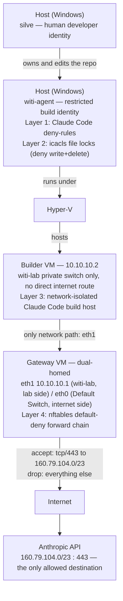

# Build environment

This is a summary view of the build-environment hardening work. For the full
findings, verification transcripts, and rationale behind each layer, see
`BUILD_ENV_HARDENING.md` — this document draws from it and does not repeat its
detail.

**Scope:** these controls protect the *development environment* — the identity and
network path used to build WITI — not WITI itself. WITI's own deliberate
vulnerabilities (A–H) are a separate track; see `STATUS.md`.

## Diagram

## Layer 1 — Coding-agent harness
**Enforces:** `deny` rules in `.claude/settings.local.json` block specific
tools/commands outright, not just require approval — e.g. reading `.env`, `curl`,
`PowerShell(Invoke-WebRequest *)`.

**Verified:** tested against a command with no model-side reason to refuse
(`curl`), so a block is attributable to enforcement, not model judgment — confirmed
denied at the permission layer, before execution, for both a Bash and a PowerShell
egress path.

## Layer 2 — OS / process identity
**Enforces:** the build identity (`witi-agent`, a non-administrator Windows
account) is denied write+delete on the project's control files
(`tool_policy.json`, `prompts/system.md`, `.claude/settings.local.json`,
`main.py`) and read+write+delete on `.env`, plus delete/delete-child on their
containing folders — enforced by Windows ACLs (`icacls`), independent of the
agent harness.

**Verified:** `runas /user:witi-agent` probes, then a live, separately-installed
Claude Code process running as `witi-agent`, both attempting the same
writes/reads/deletes — refused at the OS layer (`EPERM` /
`UnauthorizedAccessException`) before any Claude Code permission logic ran.

## Layer 3 — Sandbox / VM
**Enforces:** the build identity gets its own machine. A private Hyper-V switch
(`witi-lab`) hosts the builder VM with no direct internet route of its own; a
separate gateway VM is the only path out.

**Verified:** routing and NAT proven (the builder reaches the internet only via
the gateway); a live Claude Code install on the builder, run under its own
separate account, exercised against the Layer 4 fence below.

## Layer 4 — Network egress
**Enforces:** default-deny outbound on the gateway's `nftables` forward chain,
with one allow rule for Anthropic's published API range (`160.79.104.0/23`,
tcp/443) and DNS to `1.1.1.1`/`8.8.8.8`.

**Verified:** two-sided proof from the builder (a disallowed host times out, an
allowed Anthropic host responds normally, with only the rule changed between
the two); repeated against a live Claude Code process using both a client-side
shell command and a client-side fetch tool.

## Limitations
- **Shared IP.** Anthropic's published API range and its other hosts (login,
  installer downloads) don't all sit in the same IP block, and several
  unrelated hostnames resolve to the same address — an IP-level allow-rule
  can't distinguish "the API" from anything else answering at that address.
- **Server-side tools.** A server-side tool runs from Anthropic's own
  infrastructure — its traffic looks identical to any other allowed API call at
  the gateway, so the fence can't see or restrict what it does. Only
  client-side tools are actually tested by this fence.
- **Files-API caveat.** Allow-listing a domain grants access to every function
  behind it, including Anthropic's own Files API — itself a potential
  exfiltration channel. An IP/domain allow-list constrains where traffic goes,
  not what it carries.
- **No builder host firewall.** The builder VM has no firewall of its own — all
  egress control lives on the gateway. If the gateway's ruleset is ever wrong,
  missing, or bypassed, there is no fallback layer behind it.
- **Runtime-only temporary-rule process.** Widening the allow-list for a
  one-off need (e.g. an installer download) is done as a temporary, unsaved
  rule, closed by reloading the saved config from disk — a manual process, not
  an automated expiry.
- **Remaining Layer 2 limits.** The build identity can still modify packages
  installed in its Python virtual environment and can still edit note
  front-matter; the tool policy file is resolved relative to the working
  directory rather than an absolute path; and this containment applies to the
  separate build identity and its VM, not to everyday development done under
  the primary user account.

## See also
- `BUILD_ENV_HARDENING.md` — full findings, verification transcripts, and rationale.
- `infra/gateway/README.md` — where the exported firewall config comes from.
