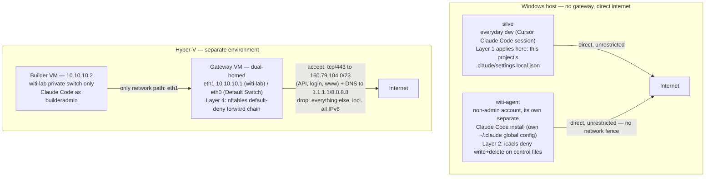

# Build environment

This is a summary view of the build-environment hardening work. For the full
findings, verification transcripts, and rationale behind each layer, see
`BUILD_ENV_HARDENING.md` — this document draws from it and does not repeat its
detail.

**Scope:** these controls protect the *development environment* — the identity and
network path used to build WITI — not WITI itself. WITI's own deliberate
vulnerabilities (A–H) are a separate track; see `README.md`.

## Diagram

Two separate environments. The host is not on the `witi-lab` switch — Hyper-V's
network fence (Layers 3–4) has no bearing on host traffic, and the host's file
locks (Layers 1–2) have no bearing on the builder VM. WITI itself has never run
inside the Hyper-V environment.

## Layer 1 — Coding-agent harness
**Enforces:** `deny` rules in this project's `.claude/settings.local.json` block
specific tools/commands outright, not just require approval — e.g. reading
`.env`, `curl`, `PowerShell(Invoke-WebRequest *)`. This file is readable by any
account — Layer 2 denies `witi-agent` write and delete on it, not read (see
below). Whether `witi-agent`'s own separately-installed Claude Code (the Layer 2
live-agent test, below) was actually launched from this project's directory,
and so had this file's rules applied to it, is **not stated** in
`BUILD_ENV_HARDENING.md` or `STATUS.md` §12–§13 — undetermined, not asserted
either way here. That install does have its own independent *global*
`~/.claude` config regardless of which project directory it was run from.

**Verified:** tested against a command with no model-side reason to refuse
(`curl`), so a block is attributable to enforcement, not model judgment — confirmed
denied at the permission layer, before execution, for both a Bash and a PowerShell
egress path.

## Layer 2 — OS / process identity
**Enforces:** the build identity (`witi-agent`, a non-administrator Windows
account) is denied write+delete on the project's control files
(`tool_policy.json`, `prompts/system.md`, `.claude/settings.local.json`,
`main.py`) and read+write+delete on `.env`, plus delete/delete-child on their
containing folders — enforced by Windows ACLs (`icacls`), independent of the
agent harness.

**Verified:**
- Original lock (writes/reads): a live, separately-installed Claude Code process
  running as `witi-agent` attempted to write `tool_policy.json` and read `.env`
  — both refused at the OS layer (`EPERM` / `UnauthorizedAccessException`)
  before any Claude Code permission logic ran.
- Finding 10 (delete/rename): PowerShell commands (`Remove-Item`, `Rename-Item`,
  `Add-Content`) run as `witi-agent` — delete and rename both denied, while an
  unlocked file's write still succeeded (folder-level deny doesn't collaterally
  block normal state writes). The project-folder rename itself was **not**
  live-tested — any process holding an open handle inside it would block the
  rename regardless of the ACL, so a live attempt wouldn't isolate what the
  permission alone is responsible for.

## Layer 3 — Sandbox / VM
**Enforces:** `builderadmin` (the builder VM's own Claude Code identity —
separate from the host's `witi-agent`) gets its own machine. A private Hyper-V
switch (`witi-lab`) hosts the builder VM with no direct internet route of its
own; a separate gateway VM is the only path out.

**Verified:** routing and NAT proven (the builder reaches the internet only via
the gateway); a live Claude Code install on the builder, run as `builderadmin`,
exercised against the Layer 4 fence below.

## Layer 4 — Network egress
**Enforces:** default-deny outbound on the gateway's `nftables` forward chain —
both the `ip filter` table (one allow rule for Anthropic's published API range,
`160.79.104.0/23` tcp/443, plus DNS to `1.1.1.1`/`8.8.8.8`) and a separate `ip6
filter` table with no accepts at all, dropping every forwarded IPv6 packet
outright so an IPv4-only rule set can't be bypassed over v6.

**Verified:** two-sided proof from the builder (a disallowed host times out, an
allowed Anthropic host responds normally, with only the rule changed between
the two). Repeated against a live Claude Code process: Bash `curl` and WebFetch
were both blocked for `example.com` and allowed for Anthropic hosts — WebFetch's
result is **strong evidence, not proof**, that it executes from the builder and
is subject to the fence, since a vague client-side error is consistent with
that without directly confirming where the request originated. WebSearch — a
server-side tool — **succeeded behind the fence regardless**: the request
asking Claude to search passes through the gateway like any other allowed API
call, but the search itself (fetching results from the wider web) runs on
Anthropic's own infrastructure and never touches the gateway.

## Limitations
- **Shared IP.** As resolved on 2026-09-16: `api.anthropic.com`, `claude.ai`,
  `claude.com`, `platform.claude.com`, and `www.anthropic.com` all resolve to
  the same address inside Anthropic's published range — an IP-level allow-rule
  can't distinguish "the API" from any of the others answering at that address.
  Only `downloads.claude.ai` resolves outside the range.
- **Server-side tools.** A server-side tool runs from Anthropic's own
  infrastructure — its traffic looks identical to any other allowed API call at
  the gateway, so the fence can't see or restrict what it does. Only
  client-side tools are actually tested by this fence.
- **Files-API caveat.** Allow-listing a domain grants access to every function
  behind it, including Anthropic's own Files API — itself a potential
  exfiltration channel. An IP/domain allow-list constrains where traffic goes,
  not what it carries.
- **No builder host firewall.** The builder VM has no firewall of its own — all
  egress control lives on the gateway. If the gateway's ruleset is ever wrong,
  missing, or bypassed, there is no fallback layer behind it.
- **Runtime-only temporary-rule process.** Widening the allow-list for a
  one-off need (e.g. an installer download) is done as a temporary, unsaved
  rule, closed by reloading the saved config from disk — a manual process, not
  an automated expiry.
- **No single environment has both controls.** `witi-agent` (the host identity)
  is file-locked (Layer 2) but has no network fence at all — its traffic goes
  straight to the internet, unrestricted. The builder VM is network-fenced
  (Layer 3/4) but has no file-level locks of its own — it's a separate machine
  that has never even held a copy of WITI's `tool_policy.json` or `main.py`.
- **Finding 3's gap is closed by Layer 2, not Layer 1.** The project's
  `.claude/settings.local.json` denies the `Edit`/`Write` tools on itself, but
  Claude Code has its own internal permission-write mechanism that those
  tool-scoped rules don't cover. What actually stops `witi-agent` from
  unlocking that file is Layer 2's OS-level icacls write+delete deny on it —
  independent of whether `witi-agent`'s Claude Code sessions even load this
  project's Layer 1 rules at all (undetermined, see Layer 1 above). Not closed
  for any other identity.
- **The `Invoke-WebRequest` deny rule is a speed bump, not a boundary.** It
  matches one command name; PowerShell aliases (`curl`, `wget`, `iwr`), the
  sibling `Invoke-RestMethod`/`irm`, and direct .NET calls (e.g.
  `[System.Net.WebClient]`) are all unmatched.
- **The fence demo doesn't cover a compromised builder attacking the gateway.**
  Claude Code on the builder ran as `builderadmin`, which has `sudo` on the
  builder itself but no access to the gateway.
- **WITI itself was never run inside the sandbox.** The fence demo installed
  and exercised Claude Code only — WITI's own Python dependencies would need
  PyPI access, which the fence blocks — so this containment has never been
  proven against a real WITI run.
- **DNS is a second outbound channel.** The gateway's DNS allow rules
  (`ip daddr { 1.1.1.1, 8.8.8.8 } udp/tcp dport 53 accept`) carry no interface
  restriction and don't inspect query content — a compromised builder could
  tunnel data out inside DNS lookups themselves, a channel the HTTPS
  allow-rule's restrictions don't touch.
- **Remaining Layer 2 limits (Finding 10).** The build identity can still
  modify packages installed in its Python virtual environment and can still
  edit note front-matter; the tool policy file is resolved relative to the
  working directory rather than an absolute path; and this containment applies
  to the separate build identity, not to everyday development done under the
  primary user account.

## See also
- `BUILD_ENV_HARDENING.md` — full findings, verification transcripts, and rationale.
- `infra/gateway/nftables.conf` — the exported firewall ruleset itself.
- `infra/gateway/README.md` — where that export comes from.
